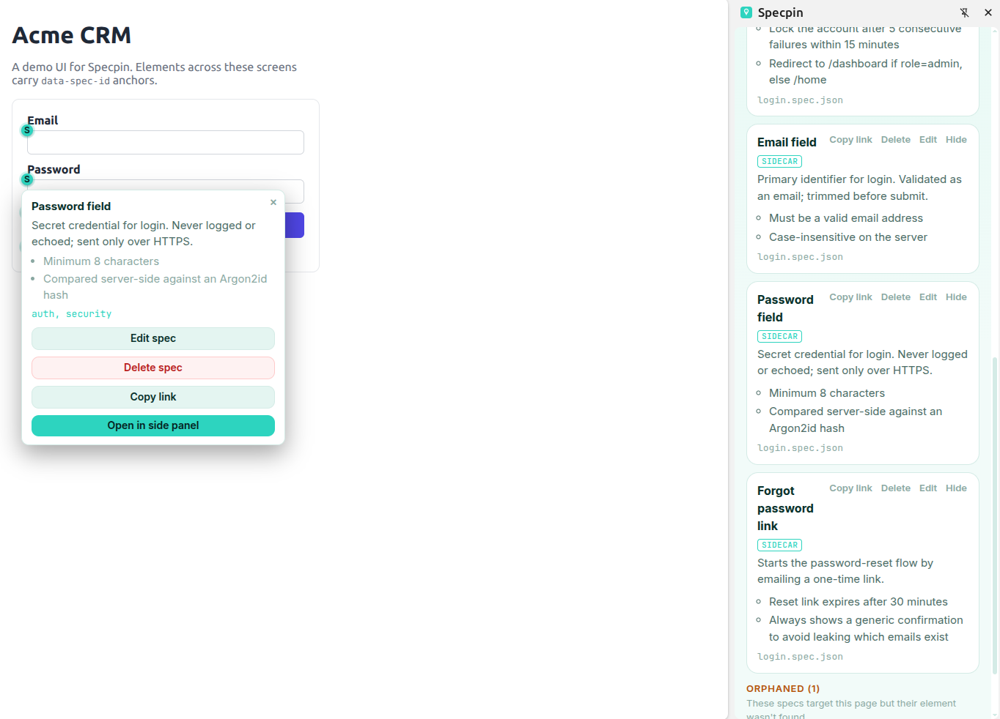

🇬🇧 [English](README.md) • 🇻🇳 [Tiếng Việt](README.vi.md) • 🇯🇵 **日本語**

<p align="center">
  
</p>

<h1 align="center">Specpin</h1>

<p align="center">
  実行中のウェブUIの要素に、生きたビジネス仕様をピン留め。<br>
  Gitネイティブ、ローカルファースト、フレームワーク非依存。<strong>コード生成なし。</strong>
</p>

<p align="center">
  <a href="https://chromewebstore.google.com/detail/specpin/kkfmoieoahdjneagognaoedggkiiolkn">
    
  </a>
  <a href="https://chromewebstore.google.com/detail/specpin/kkfmoieoahdjneagognaoedggkiiolkn">
    
  </a>
  <a href="https://chromewebstore.google.com/detail/specpin/kkfmoieoahdjneagognaoedggkiiolkn">
    
  </a>
  <a href="https://github.com/lamngockhuong/specpin/actions/workflows/ci.yml">
    
  </a>
  <a href="LICENSE">
    
  </a>
  <a href="https://github.com/lamngockhuong/specpin/stargazers">
    
  </a>
  = 22">
  
  
</p>

<p align="center">
  <a href="https://chromewebstore.google.com/detail/specpin/kkfmoieoahdjneagognaoedggkiiolkn">
    
  </a>
  
</p>

<p align="center">
  <a href="https://specpin.ohnice.app">ウェブサイト</a> •
  <a href="#クイックスタート">クイックスタート</a> •
  <a href="#機能">機能</a> •
  <a href="#仕組み">仕組み</a> •
  <a href="#ドキュメント">ドキュメント</a> •
  <a href="README.md">English</a>
</p>

<p align="center">
  
</p>

---

## Specpinとは？

Specpinは**ビジネス仕様**（ルール、説明、受け入れ基準）を、*実行中*のウェブUIの要素に直接付与し、ホバーや閲覧中にブラウザ内でレンダリングします。

Specpinは**仕様駆動のコードジェネレーター**ではありません（GitHub Spec Kit / OpenSpecとは無関係）：アプリケーションコードを生成しません。これは、既存のインターフェースに対して、Gitでバージョン管理された生きたドキュメントをピン留めするナレッジレイヤーです。インターフェースはすでにすべての要素の位置を知っています。Specpinはそこに記憶を与えます。

- **Gitネイティブ。** specはリポジトリの`.specs/`ディレクトリにJSONとして保存されます。バージョン管理され、PRでレビューでき、差分を確認できます。
- **ローカルファースト。** 小さなGoのsidecarがトークン認証されたlocalhost APIでspecを提供します。デフォルトではデータは一切外部に出ません。チームは任意で、同じsidecarをHTTPSリバースプロキシの背後にある自分のホストで実行できます（実行ガイドを参照）。
- **堅牢なリンク。** 要素はマルチシグナルのfingerprint（test-id、aria、selector、xpath、テキスト、位置）でマッチングされるため、specはリファクタリング後も生き続けます。
- **フレームワーク非依存。** 純粋なDOMマッチングにより、あらゆるサイトやフレームワークで動作します。

## 仕組み

```
.specs/ (リポジトリ内)  -->  specpin serve (GoのSidecar、localhost HTTP + SSE)  -->  ブラウザ拡張機能（マッチング + レンダリング）
```

1. `specpin init`でリポジトリに`.specs/manifest.json`を生成します。
2. `specpin serve`でトークン認証されたlocalhost HTTP APIを通じて`.specs/`を公開し、ライブリロード（SSE）を提供します。
3. ブラウザ拡張機能がsidecarに接続し、各specのfingerprintをライブDOMと照合して、要素の上にレンダリングします。

## extensionのインストール

Chrome版Specpinは**[Chrome Web Store](https://chromewebstore.google.com/detail/specpin/kkfmoieoahdjneagognaoedggkiiolkn)**からインストールできます。素早くアクセスできるようツールバーにピン留めしておきましょう。

Firefox Add-onsは近日公開予定です。それまでの間、Firefoxユーザーはソースからビルドしてunpackedで読み込めます（[実行ガイド](./docs/run-guide.md)を参照）。

## CLIのインストール

sidecarは単一の自己完結型バイナリとして提供されます。最も簡単な方法はnpm経由で、OSとCPUに合ったビルド済みバイナリを自動でダウンロードします：

```bash
npm install -g @specpin/cli     # または: pnpm add -g @specpin/cli
specpin --version

# またはインストールなしで実行:
npx @specpin/cli serve
```

バイナリを直接入手したい場合は、[最新のCLIリリース](https://github.com/lamngockhuong/specpin/releases?q=cli)から`specpin-<os>-<arch>`をダウンロードするか、ソースからビルド：`cd apps/cli && make build`。

## クイックスタート

```bash
# 1. CLIをインストール
npm install -g @specpin/cli

# 2. プロジェクトのリポジトリで: specの雛形を生成して提供
specpin init                   # .specs/manifest.json を作成
specpin serve                  # localhost URL + bearer tokenを表示

# 3. 拡張機能をインストールして接続
#    Chrome:  Chrome Web Store からインストール（上記リンク）
#    Firefox: unpacked でビルド（AMO は近日公開）-> pnpm --filter @specpin/extension build:firefox
```

表示されたURL + tokenを拡張機能の接続設定にペーストし、アプリを開くとspecが各要素にレンダリングされます。全体のフロー（init -> serve -> ロード -> 接続 -> レンダリング -> capture）については**[`docs/run-guide.md`](./docs/run-guide.md)**を参照してください。または同梱の**[デモアプリ](./examples/demo-react-app)**で試せます：

```bash
pnpm --filter @specpin/demo-react-app dev   # http://localhost:3000、.specs/ のシードデータ付き
```

### AIで spec を作成

コーディングエージェントにspecを書かせましょう。`@specpin/cli`に同梱されているskill（`https://unpkg.com/@specpin/cli@latest/skill/SKILL.md`で参照可能）が、Claude Code、Cursorなどのエージェントにスキーマ有効な`.specs/`の作成方法と`specpin validate`の実行方法を教えます。**[`docs/ai-authoring.md`](./docs/ai-authoring.md)**を参照してください。

## 機能

- **ライブ要素にspecをピン留め** - 堅牢なfingerprintマッチング（test-id、aria、selector、xpath、テキスト、位置）
- **信頼度スコアリングマッチング** - 完全一致のアンカーが失敗した場合、ハイブリッド加重スコアラーがフォールバックし、信頼度ティア、「なぜマッチしたか」のヒント、要レビューシグナルを提供
- **3つの表示モード** - tooltip、sidebar、ドラッグ可能なモーダルレンダラー
- **手動キャプチャ** - 要素をクリックしてその場でspecを作成、ページを離れる必要なし
- **カバレッジモード** - キーボードトグル（`Alt+Shift+U`）で、未ドキュメントのすべてのインタラクティブ要素にゴースト「+」マーカーを表示。「N個のインタラクティブ / M個ドキュメント済み / K個の未対応」サマリーと「未対応をすべてキャプチャ」アクション付き。無視した箇所はorigin単位で記憶
- **一括キャプチャ** - 複数の要素をまとめて選択し、1つの共有フォームから作成（タグ、ルール、ステータスは全体に適用、タイトルは要素ごと）。N個のspecを1ファイルに書き込み
- **specテンプレート** - 組み込みのスターター（フォームバリデーション、APIエラー処理、認証フロー）が、単体および一括キャプチャフォームの空欄を事前入力
- **specのクローン** - 「要素に複製」で、specの内容を新しく選んだ要素にコピー。新しいfingerprintとリセットされたprovenanceを付与するため、approved済みのspecが未レビューのコピーに化けることはない
- **その場でspecを削除** - 書き込み可能なspecをtooltipまたはサイドパネルから、破壊的な確認ダイアログを経て削除（sidecarのspecはGitから、ローカルのspecはstorageから復元可能）
- **書き込み可能なローカルプロジェクト** - sidecarなしでspecの編集、キャプチャ、作成、グループzipエクスポートが可能
- **マルチプロジェクト接続** - 1つの拡張機能で複数のプロジェクトを同時に管理、originによってページごとにルーティング
- **プロジェクト単位の有効/無効** - グローバルのオン/オフとは独立して個別の接続を切り替え可能
- **サイドパネルサーフェス** - ChromeのサイドパネルやFirefoxのsidebarでSpecpinを開き、インラインでspecを表示
- **Guide mode** - team + personalスコープのspec駆動オンボーディングツアー。spotlightオーバーレイ、アンカーされたpopover、キーボードショートカット付き
- **リーダーナビゲーション** - 共有可能なspecディープリンク、ページ内specをキーボードで巡回、「前回訪問からのN件の変更」ダイジェスト
- **spec検索** - タイトル、ファイル、タグ、説明によるクライアントサイドのリアルタイムフィルター
- **specフィルタリング** - タグ、ファイル、ページごとにfacetチェックリストでspecを表示/非表示。チームのデフォルト（コミットされた`views.json`）と個人のオーバーライド
- **ソースバッジ** - specがsidecarからなのかローカルバッチからなのかが一目でわかる
- **多言語specコンテンツ** - ロケールキーの文字列、ブラウザ内の言語切り替え、タブ形式のロケール別エディター
- **Markdownフォーマットのspec** - 説明とビジネスルールが安全なMarkdownサブセット（太字、斜体、リンク、リスト）をサポート。ツールバーで作成し、全サーフェスでレンダリング
- **ユーザー選択可能なテーマ** - システム / ライト / ダーク、デュアルテーマのデザイントークン
- **UIクロームi18n** - 英語 + ベトナム語 + 日本語インターフェース、specコンテンツ言語から独立
- **アプリ内changelog** - 「What's New」リンクでホスト済みのchangelogを開き、重要な更新時には自動で開く
- **サポート & フィードバック** - オプションページからGitHub IssuesとDiscussionsへのワンクリックリンク
- **AIでspecを作成** - `@specpin/cli`に同梱されたportable skillがコーディングエージェント（Claude Code、Cursorなど）にスキーマ有効なspecの作成とCLI操作を教えます。CLI自体にLLMは含まれません
- **provenance & trust** - オプションのspecステータス（draft / approved / deprecated）、issue/PRリンク、リンクされたテスト（`verifiedBy`）、staleインジケーター付きのレビュー鮮度
- **オフライン検証** - `specpin validate` + CI spec-lintで`.specs/`の整合性を保持
- **specヘルスガバナンス** - `specpin report`が鮮度、統計、必須specを監査し、`--fail-on`でCIをゲート
- **デフォルトでセキュア** - sidecarはデフォルトで`127.0.0.1`にバインド（リモートはHTTPSリバースプロキシ経由のオプトイン）、bearer-token認証、拡張機能originのみCORSを許可、パストラバーサル防止の書き込みガード、直列化されたマルチライター書き込み

## モノリポ構成

```text
specpin/
├── apps/
│   ├── extension/            # WXT MV3クロスブラウザ拡張機能 (Chrome + Firefox)
│   └── cli/                  # GoのSidecarバイナリ: init + serve
├── packages/
│   ├── spec-schema/          # JSON Schema v1 (SSOT) + 生成済みTS型 + バリデーター
│   ├── fingerprint-core/     # フレームワーク非依存のcapture + match（DOMのみ）
│   └── api-client/           # sidecar HTTPコントラクト用の型付きTSクライアント
├── examples/
│   └── demo-react-app/       # サンプルアプリ + Specpinを試すためのシード済み.specs/
└── docs/                     # アーキテクチャ、実行ガイド、スキーマリファレンス
```

## ツールチェーン

- Node >= 22、pnpm 11、Turborepo
- Go 1.26（sidecar CLI）
- Vitest（全TSパッケージ）、Biome（lint + format）

## ワークスペーススクリプト

```bash
pnpm install          # ワークスペースの依存関係をインストール
pnpm build            # パッケージ全体でturbo run build
pnpm test             # turbo run test (パッケージ別vitest)
pnpm lint             # biome check . (lint + format + importの整理)
pnpm typecheck        # パッケージ別tsc --noEmit
pnpm schema-validate  # fixtureコーパスのクロスバリデーション
```

単一パッケージまたは単一テスト：

```bash
pnpm --filter @specpin/fingerprint-core test
pnpm --filter @specpin/fingerprint-core exec vitest run -t "match"
```

GoのSidecar（`apps/cli`内から）：

```bash
make build          # sync-schemaの後にgo build -> bin/specpin
make check-schema   # CIゲート: 埋め込みスキーマのズレを検出
go test ./...
```

## ドキュメント

> Tiếng Việt: ドキュメントのベトナム語訳は[`docs/vi/`](./docs/vi/)にあります。英語がソースオブトゥルースです。

- [`docs/project-overview-pdr.md`](./docs/project-overview-pdr.md) - プロダクト概要、問題提起、目標、PDR
- [`docs/system-architecture.md`](./docs/system-architecture.md) - コンポーネント、パッケージ、fingerprintingセキュリティモデル
- [`docs/codebase-summary.md`](./docs/codebase-summary.md) - パッケージ別サマリー、主要ファイル、責務
- [`docs/run-guide.md`](./docs/run-guide.md) - エンドツーエンドのフル手順（init -> serve -> ロード -> 接続 -> レンダリング -> capture）
- [`docs/ai-authoring.md`](./docs/ai-authoring.md) - 同梱の`@specpin/cli` skillを使ったコーディングエージェントによるspec作成
- [`docs/schema-reference.md`](./docs/schema-reference.md) - v1 specフォーマット
- [`docs/code-standards.md`](./docs/code-standards.md) - TS/Go規約、ツール設定、スキーマ管理
- [`docs/design-system.md`](./docs/design-system.md) - 拡張機能UIモックアップ + 共有カラー/フォントトークンのワークフロー
- [`docs/deployment-guide.md`](./docs/deployment-guide.md) - ウェブサイトPagesデプロイ + 拡張機能/CLIリリースパイプライン
- [`docs/project-roadmap.md`](./docs/project-roadmap.md) - 出荷済み機能 + 予定機能

## リリース

ビルド済みの成果物は[GitHub Releases](../../releases)でコンポーネントごとにバージョン管理されて配布されます：拡張機能（`extension-vX.Y.Z`: chrome + firefox ZIP）とCLI（`cli-vX.Y.Z`: linux/macOS/windowsバイナリ）、各`checksums.txt`付き。リリースはconventional commitsから`release-please`によって自動化されています。詳細なパイプライン、手動の`workflow_dispatch`、tag-pushフォールバックについては[`docs/deployment-guide.md`](./docs/deployment-guide.md)を参照してください。

## コントリビューション

[`.github/CONTRIBUTING.md`](./.github/CONTRIBUTING.md)を参照してください。pre-commitフック（lefthook、`pnpm install`で自動インストール）がステージ済みファイルに対してBiome + typecheckを実行します。`git commit --no-verify`でスキップできます。PRを開く前に、フルゲートを実行してください：

```bash
pnpm check       # lint + typecheck + test + schema-validate
pnpm check:all   # apps/cliのGoゲート（make check-schema, go vet, go test）も実行
```

## ステータス

Specpinはリリース済みで、[Chrome Web Store](https://chromewebstore.google.com/detail/specpin/kkfmoieoahdjneagognaoedggkiiolkn)で公開中です。Firefox Add-onsは近日公開予定。開発は継続中です。出荷済みの機能・予定・意思決定ログは[`docs/project-roadmap.md`](./docs/project-roadmap.md)を参照してください。

## スポンサー

Specpinが役立つと感じたら、開発のサポートをご検討ください：

[](https://github.com/sponsors/lamngockhuong)
[](https://buymeacoffee.com/lamngockhuong)
[](https://me.momo.vn/khuong)

## その他のプロジェクト

- [TabRest](https://github.com/lamngockhuong/tabrest) - 非アクティブなタブを自動でアンロードしてメモリを解放するChrome拡張機能
- [GitHub Flex](https://github.com/lamngockhuong/github-flex) - 生産性向上機能でGitHubのインターフェースを拡張するクロスブラウザ拡張機能
- [Termote](https://github.com/lamngockhuong/termote) - モバイル/デスクトップのPWAからCLIツール（Claude Code、GitHub Copilot、任意のターミナル）をリモート操作

## ライセンス

[Apache-2.0](./LICENSE).
