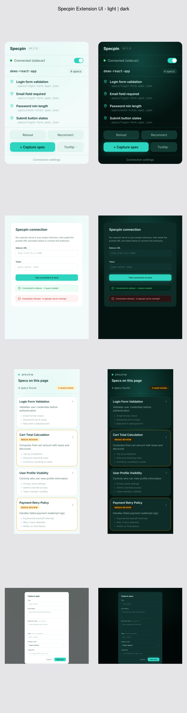

🇬🇧 **English** • 🇻🇳 [Tiếng Việt](README.vi.md) • 🇯🇵 [日本語](README.ja.md)

<p align="center">
  
</p>

<h1 align="center">Specpin</h1>

<p align="center">
  Pin living business specs onto the elements of your running web UI.<br>
  Git-native, local-first, framework-agnostic. <strong>No code generation.</strong>
</p>

<p align="center">
  <a href="https://chromewebstore.google.com/detail/specpin/kkfmoieoahdjneagognaoedggkiiolkn">
    
  </a>
  <a href="https://chromewebstore.google.com/detail/specpin/kkfmoieoahdjneagognaoedggkiiolkn">
    
  </a>
  <a href="https://chromewebstore.google.com/detail/specpin/kkfmoieoahdjneagognaoedggkiiolkn">
    
  </a>
  <a href="https://github.com/lamngockhuong/specpin/actions/workflows/ci.yml">
    
  </a>
  <a href="LICENSE">
    
  </a>
  <a href="https://github.com/lamngockhuong/specpin/stargazers">
    
  </a>
  = 20">
  
  
</p>

<p align="center">
  <a href="https://chromewebstore.google.com/detail/specpin/kkfmoieoahdjneagognaoedggkiiolkn">
    
  </a>
  
</p>

<p align="center">
  <a href="https://specpin.ohnice.app">Website</a> •
  <a href="#quick-start">Quick start</a> •
  <a href="#features">Features</a> •
  <a href="#how-it-fits-together">How it works</a> •
  <a href="#documentation">Docs</a> •
  <a href="./docs/vi/">Tiếng Việt</a>
</p>

<p align="center">
  
</p>

---

## What is Specpin?

Specpin attaches **business specifications** (rules, descriptions, acceptance criteria) directly onto the elements of a *running* web UI, then renders them in-browser as you hover or browse.

It is **not** a spec-driven code generator (unrelated to GitHub Spec Kit / OpenSpec): it generates no application code. It is a knowledge layer that pins living, Git-versioned documentation onto the interface you already have. The interface already knows where everything is; Specpin gives it a memory.

- **Git-native.** Specs live as JSON in your repo's `.specs/` directory: versioned, reviewable via PR, and diffable.
- **Local-first.** A small Go sidecar serves your specs over a token-authenticated localhost API; by default nothing leaves your machine. Teams can optionally run that same sidecar on their own host behind an HTTPS reverse proxy (see the run guide).
- **Resilient links.** Elements are matched by multi-signal fingerprints (test-id, aria, selector, xpath, text, position), so specs survive refactors.
- **Framework-agnostic.** Pure DOM matching works on any site or framework.

## How it fits together

```
.specs/ (in your repo)  -->  specpin serve (Go sidecar, localhost HTTP + SSE)  -->  browser extension (match + render)
```

1. `specpin init` scaffolds `.specs/manifest.json` in your repo.
2. `specpin serve` exposes `.specs/` over a token-authenticated localhost HTTP API with live-reload (SSE).
3. The browser extension connects to the sidecar, matches each spec's fingerprint against the live DOM, and renders it on its element.

## Install the extension

Install Specpin for Chrome from the **[Chrome Web Store](https://chromewebstore.google.com/detail/specpin/kkfmoieoahdjneagognaoedggkiiolkn)**. Pin it to your toolbar for quick access.

Firefox Add-ons is coming soon. Until then, Firefox users can build from source and load it unpacked (see the [run guide](./docs/run-guide.md)).

## Install the CLI

The sidecar ships as a single self-contained binary. Easiest is via npm, which
downloads the prebuilt binary matching your OS and CPU:

```bash
npm install -g @specpin/cli     # or: pnpm add -g @specpin/cli
specpin --version

# or run without installing:
npx @specpin/cli serve
```

Prefer a raw binary? Grab `specpin-<os>-<arch>` from the
[latest CLI release](https://github.com/lamngockhuong/specpin/releases?q=cli), or
build from source: `cd apps/cli && make build`.

## Quick start

```bash
# 1. Install the CLI
npm install -g @specpin/cli

# 2. In your project repo: scaffold and serve specs
specpin init                   # creates .specs/manifest.json
specpin serve                  # prints a localhost URL + bearer token

# 3. Install the extension and connect
#    Chrome:  install from the Chrome Web Store (link above)
#    Firefox: build unpacked (AMO coming soon) -> pnpm --filter @specpin/extension build:firefox
```

Paste the printed URL + token into the extension's connection settings, open your app, and specs render on their elements. See **[`docs/run-guide.md`](./docs/run-guide.md)** for the full init -> serve -> load -> connect -> render -> capture loop, or try it against the bundled **[demo app](./examples/demo-react-app)**:

```bash
pnpm --filter @specpin/demo-react-app dev   # http://localhost:3000, ships seeded .specs/
```

### Author with AI

Let a coding agent write your specs. A skill bundled in `@specpin/cli` (reachable at `https://unpkg.com/@specpin/cli@latest/skill/SKILL.md`) teaches Claude Code, Cursor, and similar agents to author schema-valid `.specs/` and run `specpin validate`. See **[`docs/ai-authoring.md`](./docs/ai-authoring.md)**.

## Features

- **Pin specs onto live elements** - resilient fingerprint matching (test-id, aria, selector, xpath, text, position)
- **Three display modes** - tooltip, sidebar, and draggable modal renderers
- **Manual capture** - click an element and author a spec in place, no leaving the page
- **Delete specs in place** - remove a writable spec from the tooltip or side panel behind a destructive confirm (sidecar specs recover from Git; local specs from storage)
- **Writable local projects** - edit, capture, create, and group-zip export specs without a running sidecar
- **Multi-project connections** - one extension serves many projects at once, routed to each page by origin
- **Per-project enable/disable** - toggle individual connections independently of the global on/off
- **Side panel surface** - open Specpin in Chrome's side panel / Firefox's sidebar, with inline spec detail
- **Spec search** - live client-side filter by title, file, tags, and description
- **Source badges** - see at a glance whether a spec comes from the sidecar or a local batch
- **Multi-language spec content** - locale-keyed strings with an in-browser language toggle and a tabbed per-locale editor
- **Markdown-formatted specs** - descriptions and business rules carry a safe Markdown subset (bold, italic, links, lists), authored via a toolbar and rendered across every surface
- **User-selectable theme** - System / Light / Dark, dual-theme design tokens
- **UI-chrome i18n** - English + Vietnamese interface, independent from spec content language
- **Support & Feedback** - one-click links from Options to the project's GitHub Issues and Discussions
- **Author with AI** - a portable skill bundled in `@specpin/cli` teaches your coding agent (Claude Code, Cursor, etc.) to write schema-valid specs and drive the CLI; no LLM in the CLI itself
- **Offline validation** - `specpin validate` + CI spec-lint to keep `.specs/` honest
- **Secure by default** - sidecar binds `127.0.0.1` by default (remote is opt-in over an HTTPS reverse proxy), bearer-token auth, extension-origin CORS, path-traversal guarded writes, serialized multi-writer writes

## Monorepo layout

```text
specpin/
├── apps/
│   ├── extension/            # WXT MV3 cross-browser extension (Chrome + Firefox)
│   └── cli/                  # Go sidecar binary: init + serve
├── packages/
│   ├── spec-schema/          # JSON Schema v1 (SSOT) + generated TS types + validators
│   ├── fingerprint-core/     # framework-agnostic capture + match (DOM only)
│   └── api-client/           # typed TS client over the sidecar HTTP contract
├── examples/
│   └── demo-react-app/       # sample app + seeded .specs/ for trying Specpin
└── docs/                     # architecture, run guide, schema reference
```

## Toolchain

- Node >= 20, pnpm 10, Turborepo
- Go 1.26 (sidecar CLI)
- Vitest (all TS packages), Biome (lint + format)

## Workspace scripts

```bash
pnpm install          # install workspace deps
pnpm build            # turbo run build across packages
pnpm test             # turbo run test (vitest per package)
pnpm lint             # biome check . (lint + format + import organize)
pnpm typecheck        # tsc --noEmit per package
pnpm schema-validate  # cross-validate the fixture corpus
```

Single package or single test:

```bash
pnpm --filter @specpin/fingerprint-core test
pnpm --filter @specpin/fingerprint-core exec vitest run -t "match"
```

Go sidecar (from `apps/cli`):

```bash
make build          # sync-schema then go build -> bin/specpin
make check-schema   # CI gate: fails if the embedded schema drifted
go test ./...
```

## Documentation

> Tiếng Việt: bản dịch các tài liệu nằm trong [`docs/vi/`](./docs/vi/). English is the source of truth.

- [`docs/project-overview-pdr.md`](./docs/project-overview-pdr.md) - product overview, problem statement, goals, PDR
- [`docs/system-architecture.md`](./docs/system-architecture.md) - components, packages, fingerprinting, security model
- [`docs/codebase-summary.md`](./docs/codebase-summary.md) - per-package summary, key files, responsibilities
- [`docs/run-guide.md`](./docs/run-guide.md) - the full end-to-end loop (init -> serve -> load -> connect -> render -> capture)
- [`docs/ai-authoring.md`](./docs/ai-authoring.md) - authoring specs with a coding agent via the bundled `@specpin/cli` skill
- [`docs/schema-reference.md`](./docs/schema-reference.md) - the v1 spec format
- [`docs/code-standards.md`](./docs/code-standards.md) - TS/Go conventions, tooling config, schema management
- [`docs/design-system.md`](./docs/design-system.md) - extension UI mockups + shared color/font token workflow
- [`docs/deployment-guide.md`](./docs/deployment-guide.md) - website Pages deploy + extension/CLI release pipeline
- [`docs/project-roadmap.md`](./docs/project-roadmap.md) - shipped capabilities + planned features

## Releases

Prebuilt artifacts ship via [GitHub Releases](../../releases), versioned per
component: the extension (`extension-vX.Y.Z`: chrome + firefox zips) and the CLI
(`cli-vX.Y.Z`: linux/macOS/windows binaries), each with `checksums.txt`. Releases
are driven by `release-please` from conventional commits; see
[`docs/deployment-guide.md`](./docs/deployment-guide.md) for the full pipeline,
manual `workflow_dispatch`, and tag-push fallbacks.

## Contributing

See [`.github/CONTRIBUTING.md`](./.github/CONTRIBUTING.md). Before opening a PR, run the full gate:

```bash
pnpm lint && pnpm typecheck && pnpm test && pnpm schema-validate
cd apps/cli && make check-schema && go test ./...
```

## Status

Specpin is released and live on the [Chrome Web Store](https://chromewebstore.google.com/detail/specpin/kkfmoieoahdjneagognaoedggkiiolkn); Firefox Add-ons is coming soon. Active development continues.

Shipped: the Go sidecar serves `.specs/`, and the WXT extension matches fingerprints and renders specs (tooltip + sidebar + modal) with manual capture. Specs are multi-language (in-browser language toggle + tabbed per-locale editor) and carry a safe Markdown subset authored via a toolbar; the extension connects to multiple projects at once, routed by origin. Also: writable local projects (edit, capture, create, group-zip export), single-spec deletion, guide mode (spec-driven onboarding tours), offline `specpin validate` + CI spec-lint, client-side spec search, source badges, per-project enable/disable, a side panel surface, user-selectable theme (System / Light / Dark), and UI-chrome i18n (EN + VI + JA).

Planned / under consideration: the FileSystem Access source, hybrid fingerprint scoring, the overlay + inline-badge renderers, Safari packaging, and `specpin generate` (AI-assisted capture).

## Sponsor

If you find Specpin useful, consider supporting its development:

[](https://github.com/sponsors/lamngockhuong)
[](https://buymeacoffee.com/lamngockhuong)
[](https://me.momo.vn/khuong)

## Other Projects

- [TabRest](https://github.com/lamngockhuong/tabrest) - Chrome extension that automatically unloads inactive tabs to free memory
- [GitHub Flex](https://github.com/lamngockhuong/github-flex) - Cross-browser extension that enhances GitHub's interface with productivity features
- [Termote](https://github.com/lamngockhuong/termote) - Remote control CLI tools (Claude Code, GitHub Copilot, any terminal) from mobile/desktop via PWA

## License

[Apache-2.0](./LICENSE).
